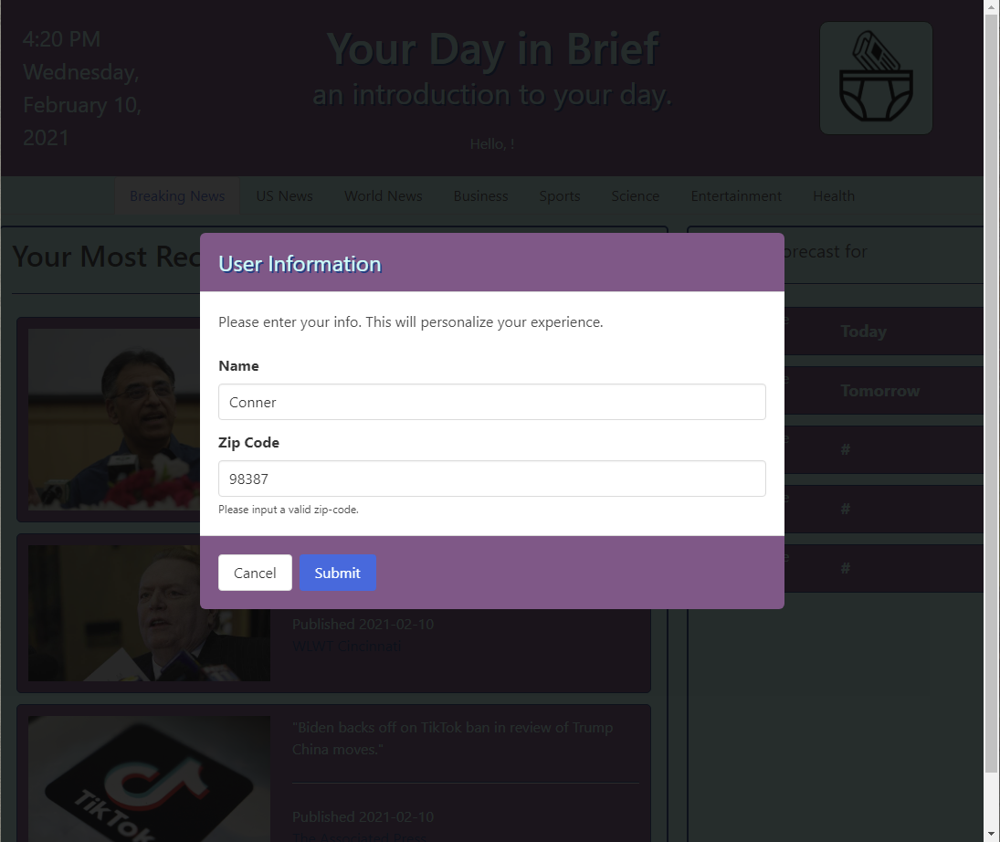
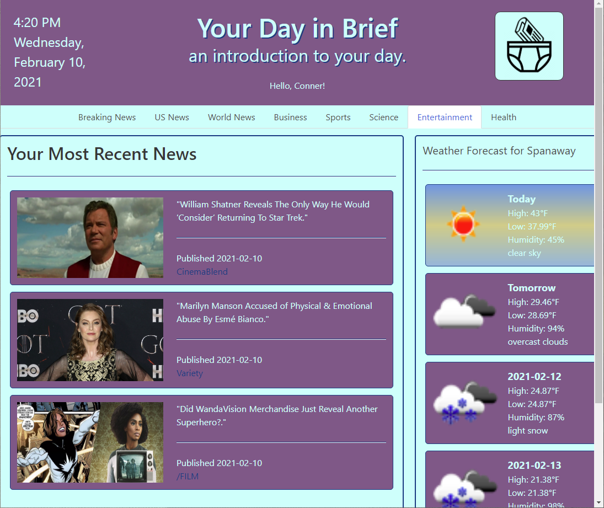

# Your-Day-in-Brief

## Table of Contents

- [Introduction](#introduction)
- [Authors](#authors)
- [Technologies](#technologies)
- [Launch](#launch)
- [Images](#images)
- [Notes](#notes)

## Introduction

This application will allow users to access the latest news and weather for the current day.

## Authors

- Conner Martin
- Jasur Amirov
- Justin Walker
- Momna Qamar
- Shayla Stevenson

## Technologies

- HTML
- CSS
  - Bulma 0.9.1
- JavaScript
  - jQuery 3.5.1
- ~~Currents API~~
- ~~Mediastack API~~
- Gnews API
- Open Weather API
- Luxon js

## Launch

- [GitHub Repository](https://github.com/Connerjm/Your-Day-in-Brief)
- [Deployment](https://connerjm.github.io/Your-Day-in-Brief/)

## Images

Enter your information

Welcome to the future

## Notes

### Conventions We Should Follow-

- css classes and ids - lowercase-with-hyphens
- constants - ALL_UPPER_WITH_UNDERSCORE
- variables - camelCase
- functions - PascalCase

### Versions-

- Bulma 0.9.1
- jQuery 3.5.1
